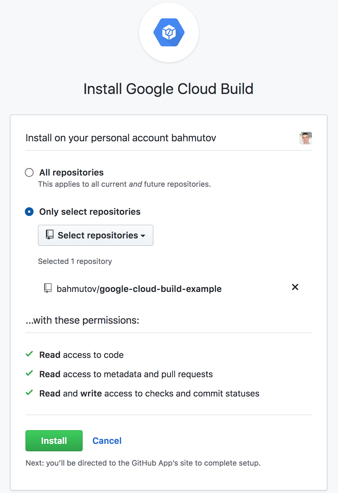
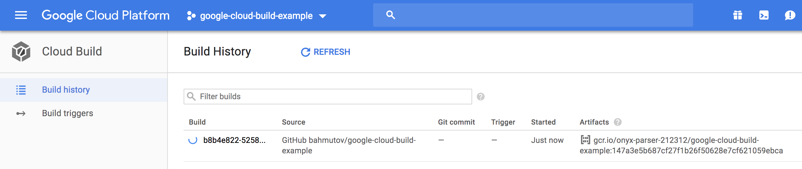

# google-cloud-build-example [![renovate-app badge][renovate-badge]][renovate-app]

> Example running Cypress end-to-end tests on Google Cloud Build

## Steps

- enabled Google account
- created new project `google-cloud-build-example`
- set up billing (free for a year)
- added Google Cloud Build GitHub app

As soon as I pushed a commit to GitHub I can see the build

## Related information

- [Google Cloud Build](https://cloud.google.com/cloud-build/)
- [Making Small Docker Image](https://glebbahmutov.com/blog/making-small-docker-image/)

[renovate-badge]: https://img.shields.io/badge/renovate-app-blue.svg
[renovate-app]: https://renovateapp.com/
